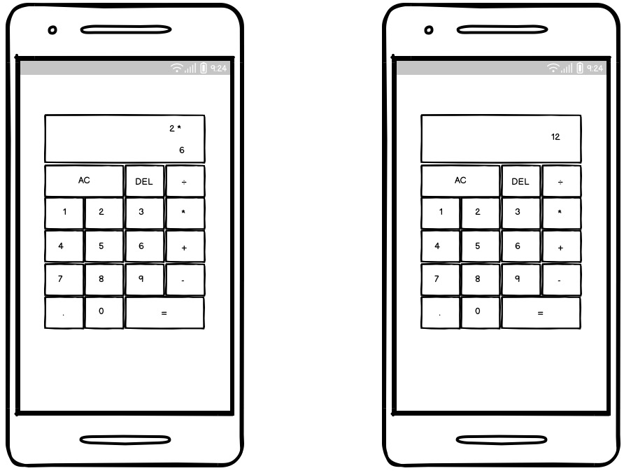

# Calculator
(Developer: roddersnz)

## Table of Contents

1. [Project Goals](#project-goals)
    1. [User Goals](#user-goals)
    2. [Site Owner Goals](#site-owner-goals)
2. [User Experience](#user-experience)
    1. [Target Audience](#target-audience)
    2. [User Requirements and Expectations](#user-requirements-and-expectations)
    3. [User Stories](#user-stories)
3. [Design](#design)
    1. [Design Choices](#design-choices)
    2. [Colour](#colours)
    3. [Fonts](#fonts)
    4. [Structure](#structure)
    5. [Wireframes](#wireframes)
4. [Technologies Used](#technologies-used)
    1. [Languages](#languages)
    2. [Frameworks & Tools](#frameworks-&-tools)
5. [Features](#features)
6. [Testing](#validation)
    1. [HTML Validation](#HTML-validation)
    2. [CSS Validation](#CSS-validation)
    3. [JavaScript Validation](#javascript-validation)
    4. [Performance](#performance)
    5. [Device testing](#performing-tests-on-various-devices)
    6. [Browser compatibility](#browser-compatability)
    7. [Testing user stories](#testing-user-stories)
8. [Bugs](#Bugs)
9. [Deployment](#deployment)
10. [Credits](#credits)
11. [Acknowledgments](#acknowledgments)

## Project Goals 
Calculator for standard operations

### User Goals

- Calculate simple maths using operations and numbers 
- Perform more complex maths using percentge

### Site Owner Goals
- Create a functional and user friendly calculator
- Calculator is fully responsive and able to open on different devices

## User Experience

### Target Audience
- People looking at making regular calculations for day to day work and study

### User Requirements and Expectations
- Navigation system tha is simple and intuitive
- Quick and simple functions that work as expected
- Visually appealing design regardless of screen size
- Accessibility

### User Stories
1. As a user, I want to add, subtract, multiply and divide two numbers
2. As a user, I want to clear the input field with a AC button
3. As a user, I want to delete incorrect number typed with DEL button
4. As a user, I want to chain mathematical operations together until I hit the equal button, and the calculator will tell me the correct output

## Design

### Design Choices
- Design for the calculator is minimalistic and visually appealing
- Buttons are large enough for easy tapping or clicking on different devices
- Layout is and organized, with clear divisions between the buttons and the input field
- Color scheme is neutral and professional

### Colour
- The color scheme uses a combination of black and white and variations of gray, green and blue 
- Background color has a linear effect

### Fonts
- Font choice used is Orbitron because ot its geometric typeface intended for display and it's easy to read

### Structure

- The structure of the calculator is organized and easy to navigate with clear divisions between the buttons and the input field

### Wireframes

Desktop

Tablet

Mobile

