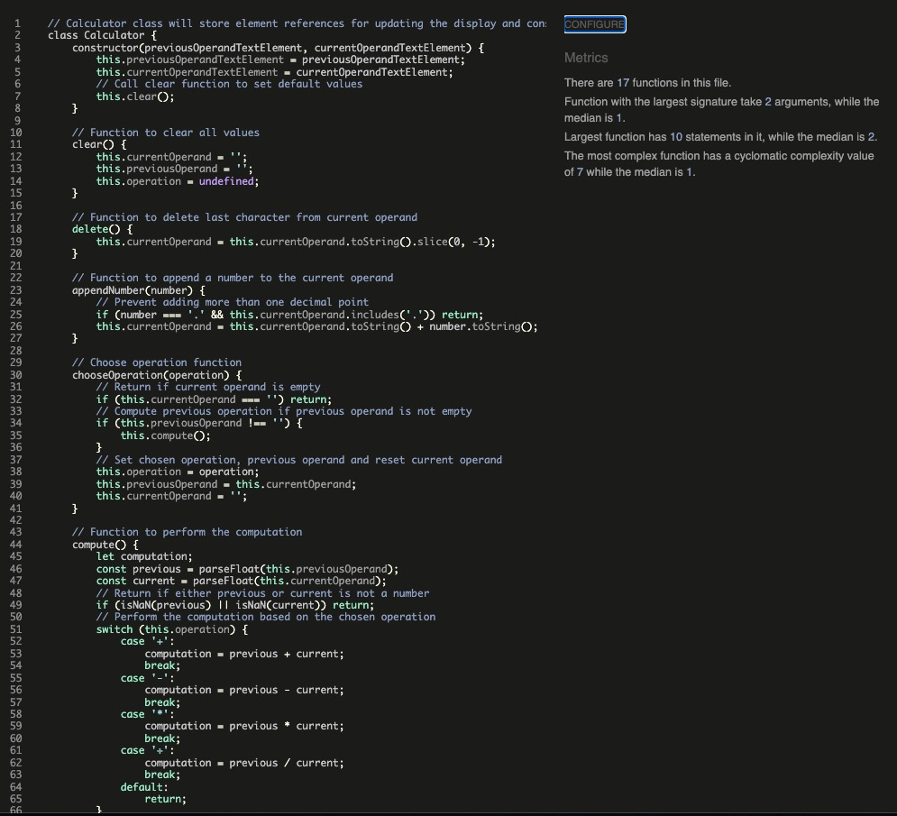
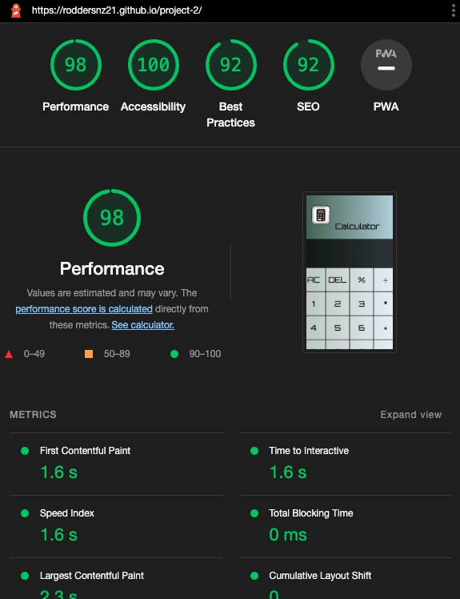
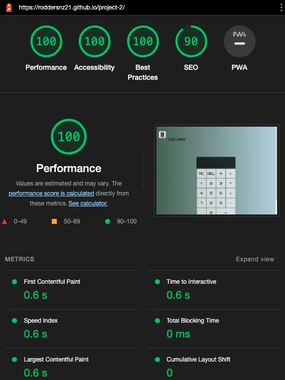
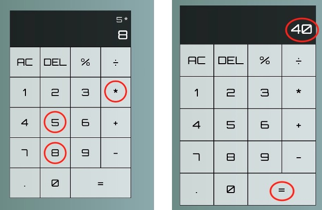
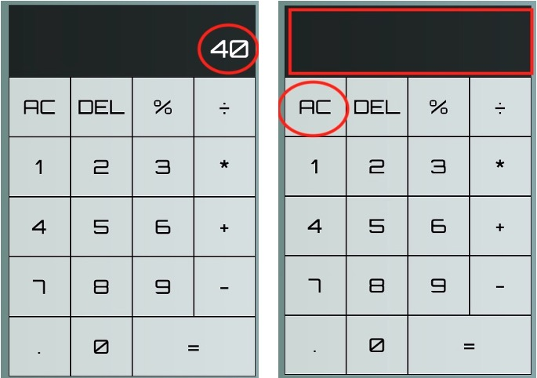
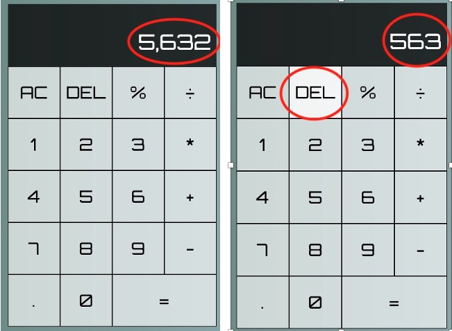
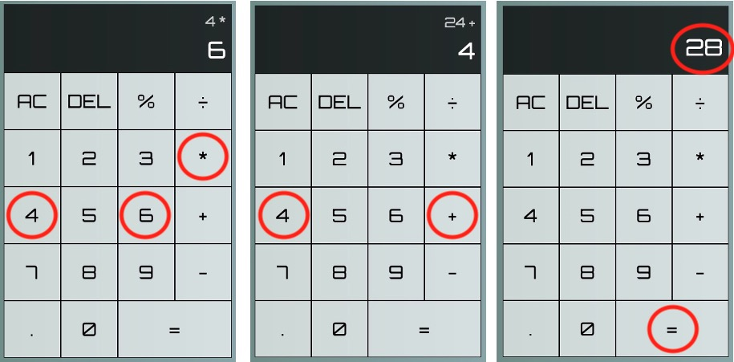

# Calculator
(Developer: roddersnz)

## Table of Contents

1. [Project Goals](#project-goals)
    1. [User Goals](#user-goals)
    2. [Site Owner Goals](#site-owner-goals)
2. [User Experience](#user-experience)
    1. [Target Audience](#target-audience)
    2. [User Requirements and Expectations](#user-requirements-and-expectations)
    3. [User Stories](#user-stories)
3. [Design](#design)
    1. [Design Choices](#design-choices)
    2. [Colour](#colours)
    3. [Fonts](#fonts)
    4. [Structure](#structure)
    5. [Wireframes](#wireframes)
4. [Technologies Used](#technologies-used)
    1. [Languages](#languages)
    2. [Frameworks & Tools](#frameworks-&-tools)
5. [Features](#features)
6. [Testing](#validation)
    1. [HTML Validation](#HTML-validation)
    2. [CSS Validation](#CSS-validation)
    3. [JavaScript Validation](#javascript-validation)
    4. [Accessibility](#accessibility)
    5. [Performance](#performance)
    6. [Device testing](#performing-tests-on-various-devices)
    7. [Browser compatibility](#browser-compatability)
    8. [Testing user stories](#testing-user-stories)
8. [Bugs](#Bugs)
9. [Deployment](#deployment)
10. [Credits](#credits)
11. [Acknowledgments](#acknowledgments)

## Project Goals 
Calculator for standard operations

### User Goals

- Calculate simple maths using operations and numbers 
- Perform more complex maths using percentge

### Site Owner Goals
- Create a functional and user friendly calculator
- Calculator is fully responsive and able to open on different devices

## User Experience

### Target Audience
- People looking at making regular calculations for day to day work and study

### User Requirements and Expectations
- Navigation system tha is simple and intuitive
- Quick and simple functions that work as expected
- Visually appealing design regardless of screen size
- Accessibility

### User Stories
1. As a user, I want to add, subtract, multiply and divide numbers
2. As a user, I want to clear the input field with a AC button
3. As a user, I want to delete incorrect number typed with DEL button
4. As a user, I want to chain mathematical operations together until I hit the equal button, and the calculator will tell me the correct output

## Design

### Design Choices
- Design for the calculator is minimalistic and visually appealing
- Buttons are large enough for easy tapping or clicking on different devices
- Layout is and organized, with clear divisions between the buttons and the input field
- Color scheme is neutral and professional

### Colour
- The color scheme uses a combination of black and white and variations of gray, green and blue 
- Background color has a linear effect

### Fonts
- Font choice used is Orbitron because ot its geometric typeface intended for display and it's easy to read

### Structure

- The structure of the calculator is organized and easy to navigate with clear divisions between the buttons and the input field

### Wireframes

Desktop

Tablet

Mobile

## Technologies Used

### Languages
- HTML for structure
- CSS for styling
- JavaScript for interactivity

### Frameworks & Tools
- GitHub
- Gitpod
- Favicon.io
- Lighthouse
- W3C Markup validation service
- W3C Jigsaw CSS validation service 
- JSHint
- WAVE WebAIM web accessibility evaluation tool

## Features
The calculator has the following features:

- Perform basic arithmetic operations such as addition, subtraction, multiplication, division as well as percentage
- Clear the input field with the AC button
- Delete an incorrect number typed with the DEL button
- Chain mathematical operations together 
- Calculates the final output when equals button is clicked
- Responsive design for different screen sizes

## Validation

### HTML Validation
The W3C Markup Validation Service was used to validate the HTML of the website and passed with no error or warnings.

Calculator

### CSS Validation
The W3C Jigsaw CSS Validation Service was used to validate the CSS of the website. Page passed with one warning which no action is necessary.

Calculator

### JavaScript Validation
JSHint Static Code Analysis Tool for JavaScript was used to validate the Javascript files. 27 warnings which I need to address.

Calculator

### Accessibility
The WAVE WebAIM web accessibility evaluation tool was used to ensure the website met high accessibility standards. Page passed with 0 errors.

Calculator

### Performance 
Google Lighthouse in Google Chrome Developer Tools was used to test the performance of the website.

Mobile

Desktop

### Performing tests on various devices 
The website was tested on the following devices:

- iPhone 14+
- Samsung Galaxy S10e
- MacBook Air

Website was also tested using Google Chrome Developer Tools Device Toggling option for all available device options.

### Browser Compatability
Website was tested on the following browsers:

- Google Chrome
- Mozilla Firefox
- Microsoft Edge

### Testing user stories

1. As a user, I want to add, subtract, multiply and divide numbers

| **Feature** | **Action** | **Expected Result** | **Actual Result** |
|-------------|------------|---------------------|-------------------|
| Home page | Click on number, operation, number and equals button | Display screen shows result | Works as expected |

User Story 1

2. As a user, I want to clear the input field with a AC button

| **Feature** | **Action** | **Expected Result** | **Actual Result** |
|-------------|------------|---------------------|-------------------|
| Home page | Click on AC button | Display clears | Works as expected |

User Story 2

3. As a user, I want to delete incorrect number typed with DEL button

| **Feature** | **Action** | **Expected Result** | **Actual Result** |
|-------------|------------|---------------------|-------------------|
| Home page | Click on DEL button | Display previous number | Works as expected |

User Story 3

4. As a user, I want to chain mathematical operations together until I hit the equal button and the calculator displays correct output

| **Feature** | **Action** | **Expected Result** | **Actual Result** |
|-------------|------------|---------------------|-------------------|
| Home page | Click on number, operation, number, operation again and equals button| Display screen shows result | Works as expected |

User Story 4

## Bugs

| **Bug** | **Fix** |
| ----------- | ----------- |

## Deployment
The website was deployed using GitHub Pages by following these steps:
1. In the GitHub repository navigate to the Settings tab
2. On the left-hand menu select Pages
3. For the Source drop-dwon menu select: Deploy from a branch
4. For the Branch drop-down menu select: main and hit Save button
5. After the webpage refreshes automatically you will ses a ribbon on the top saying: "Your site is published at https://roddersnz21.github.io/project-2/

You can fork the repository by following these steps:
1. Go to the GitHub repository
2. Click on Fork button in the upper right hand corner

You can clone the repository by following these steps:
1. Go to the GitHub repository 
2. Click on Code button above the list of files
3. Select if you prefer to clone using HTTPS, SSH, or Github CLI and click the copy button to copy the URL to your clipboard
4. Paste to your editor

## Credits

## Acknowledgments
I would like to thank:
- My mentor Dick Vlaanderen for his feedback, advice, guidance and support
- My cohort facilitator Paul Thomas for his dedication and patience doing weekly meetings with ideas and advice
- My wife for her support and giving me free time to work on my project

